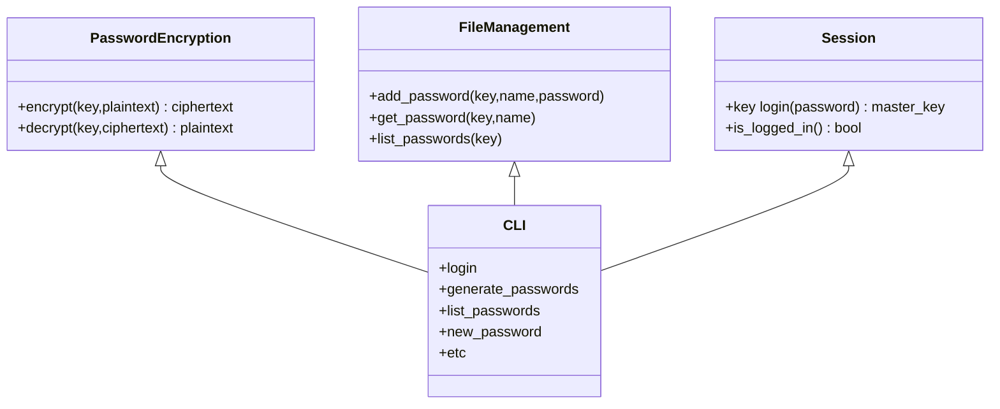

# Design Notes

- terminal program
- user invokes commands like `vaultlock login`, `vaultlock generate-password`, `vaultlock get-password`, `vaultlock list-passwords`, etc.
- program access passwords in a single password file
- program has a session file to determine whether or not it's logged in, which expires after some time

## Interfaces

Each "class" in this diagram should probably just be a Python module with bare functions.

- CLI: might want to mock the other interfaces while implementing to avoid being blocked
- FileManagement: each function will open the file, operate on it, and close it, so the file is closed between calls
- Session: will manage some kind of persistent state, as a file or process or something
